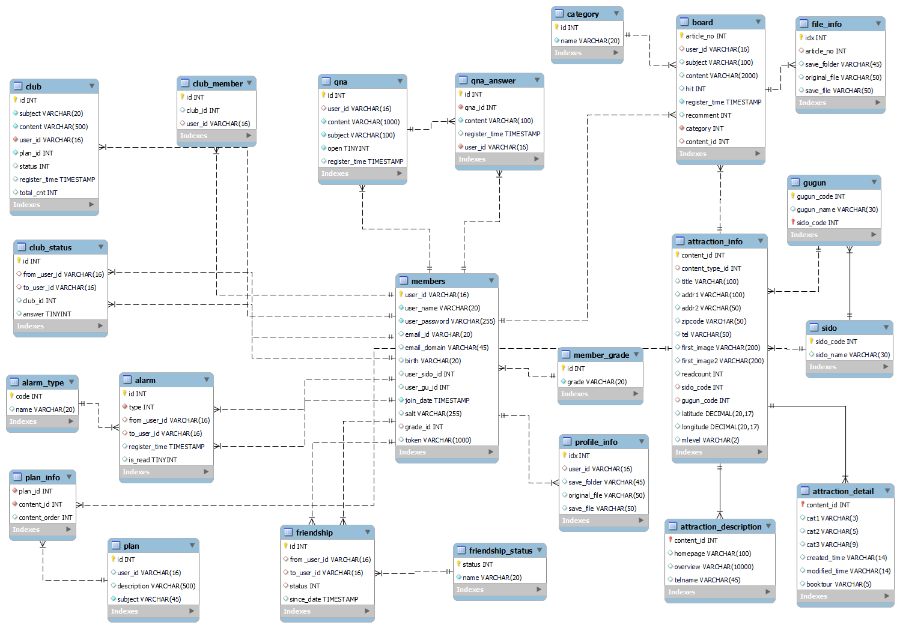
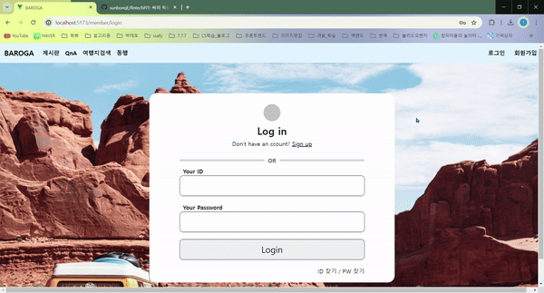
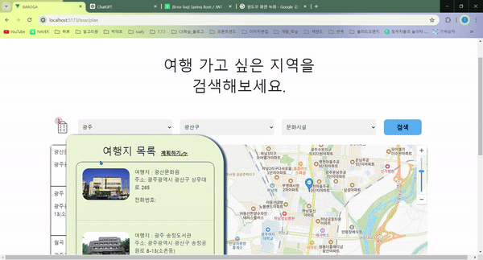
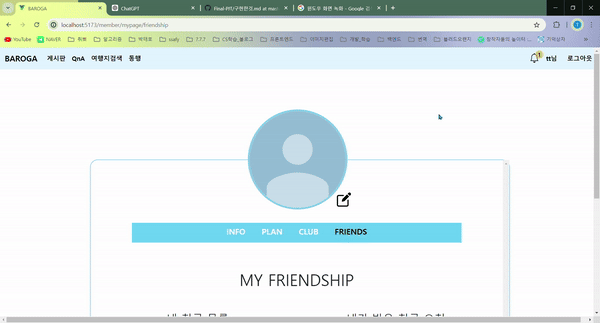
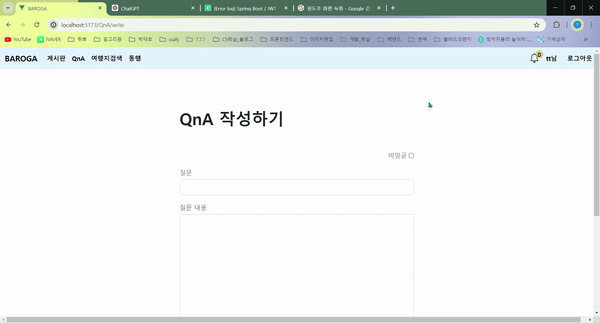
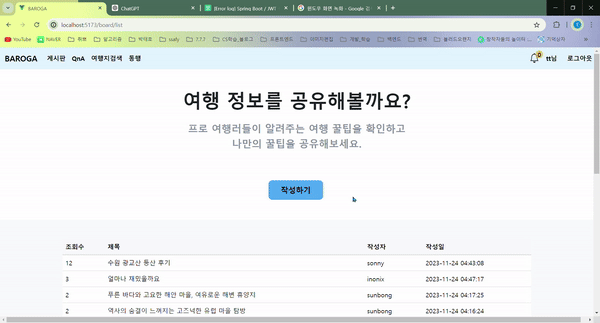

# trip

This template should help get you started developing with Vue 3 in Vite.

## Recommended IDE Setup

[VSCode](https://code.visualstudio.com/) + [Volar](https://marketplace.visualstudio.com/items?itemName=Vue.volar) (and disable Vetur) + [TypeScript Vue Plugin (Volar)](https://marketplace.visualstudio.com/items?itemName=Vue.vscode-typescript-vue-plugin).

## Customize configuration

See [Vite Configuration Reference](https://vitejs.dev/config/).

## Project Setup

```sh
npm install
```

### Compile and Hot-Reload for Development

```sh
npm run dev
```

### Compile and Minify for Production

```sh
npm run build
```

### Lint with [ESLint](https://eslint.org/)

```sh
npm run lint
```

---
[BE_PJT_Link](https://github.com/sunbongE/Trip_BE)

# 주기능
- 위치기반 관광지 추천 : 키워드를 입력하면 키워드가 포함된 관광지를 추천합니다.
- 동행 모집 : 함께 여행할 인원을 모집글을 통해 모집할 수 있습니다.
- 여행 계획 : 전국을 기준으로 지역, 시군구, 관광지 유형으로 구분하여 검색후 여행 계획을 할 수 있습니다. 또한 여행지를 상세히 알고싶다면 유튜브로 검색하여 더 생생한 정보를 받을 수 있습니다.

## 역할
BE, FE
### 맡은 기능 및 페이지
- 회원 : 로그인, 회원가입, 아이디 중복확인
- 메인 화면 : 페이지 구현
- 글 : CRUD, 게시판, QnA, 이미지 업로드
- 여행지 검색 : kakaoMap 활용, 여행지 카테고리별 검색, 유튜브 검색, 계획 추가
- 여행 모집글 : CRUD

---
### ERD
<details>
  <summary>👉열기</summary>
    &nbsp; &nbsp;
</details>
</br>

---

# 페이지

## 회원가입
> 중복이 아닌 아이디로 회원가입을 할 수 있습니다.

&nbsp; &nbsp;


## 로그인

&nbsp; &nbsp;


## 메인
> 어디에 가고 싶은지 입력하시면 키워드를 포함한 관광지를 추천하며 자신의 위치와 가까운 순으로 정렬하여 정보가 제공됩니다.  

&nbsp; &nbsp;

</br>

&nbsp; &nbsp;

</br>

## 여행 계획
> 유튜브, 카테고리 등으로 여행지를 미리 확인할 수 있습니다.

&nbsp; &nbsp;

</br>

&nbsp; &nbsp;


## 동행 모집
> 여행원 모집글 작성

</br>

&nbsp; &nbsp;

> 여행 참가 요청

</br>
&nbsp; &nbsp;

## 마이페이지
> 개인정보를 수정할 수 있고, 본인이 올린 여행 글 등을 확인할 수 있습니다.
친구요청 승인, 친구 목록 확인 등을 할 수 있습니다.

</br>

&nbsp; &nbsp;


## QnA, 게시글

&nbsp; &nbsp;
&nbsp; &nbsp;


